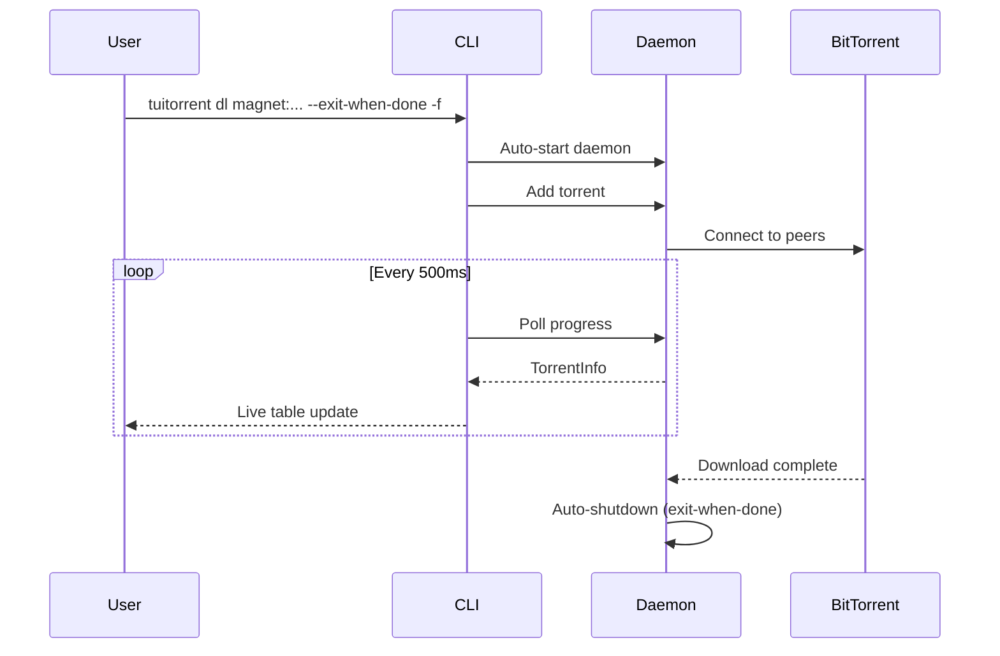
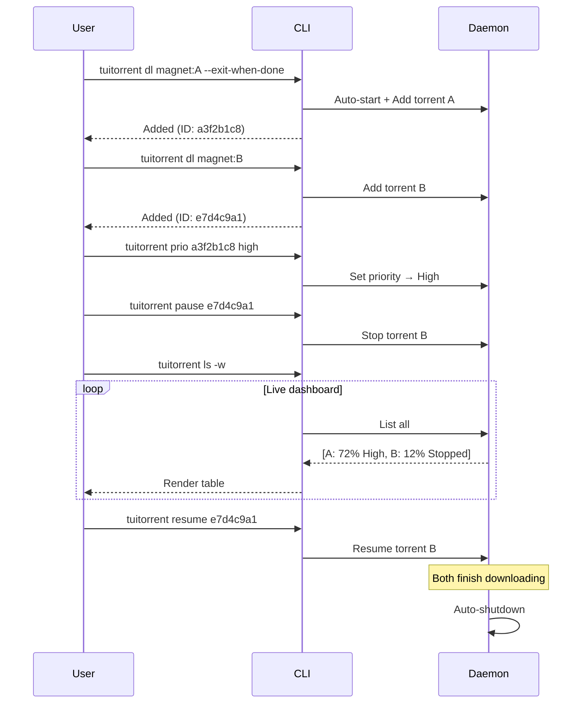
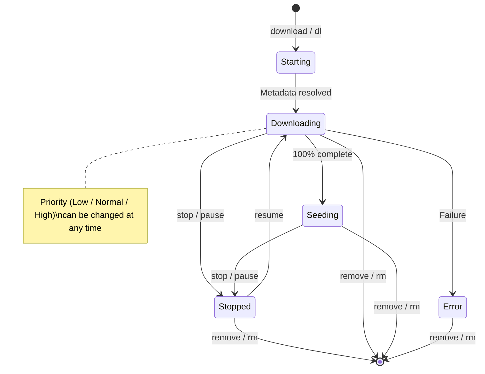
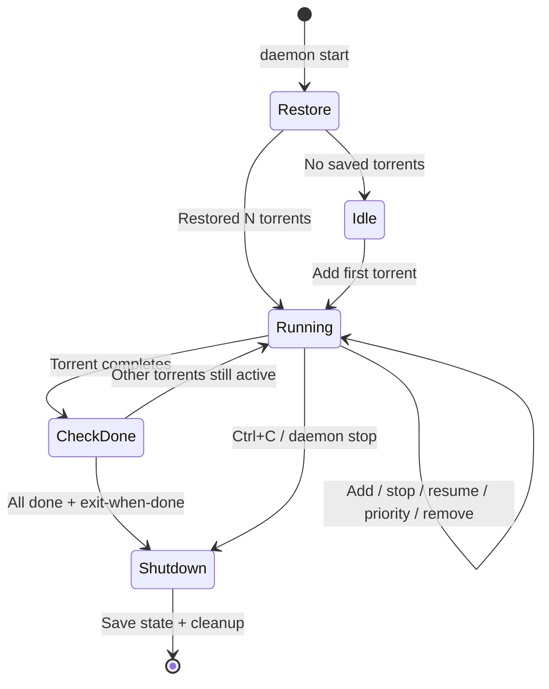
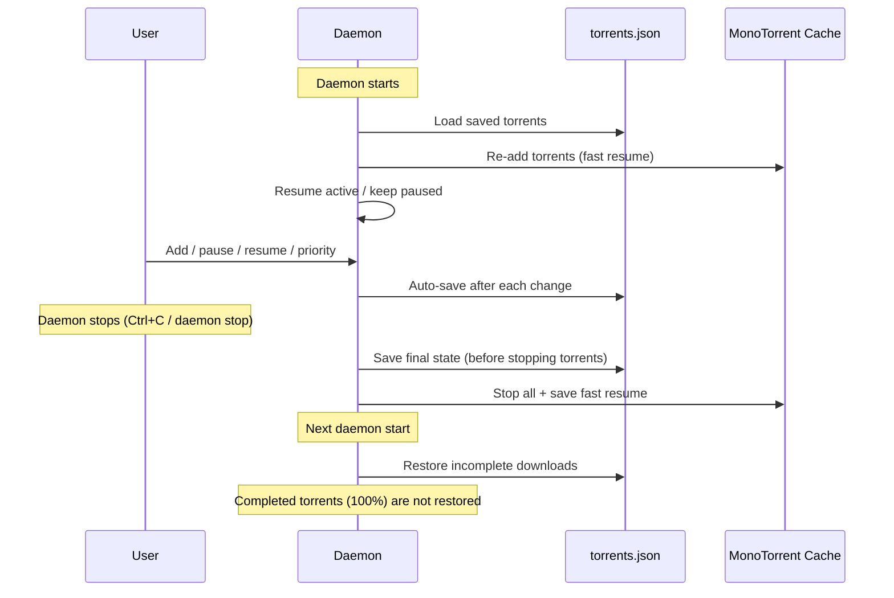
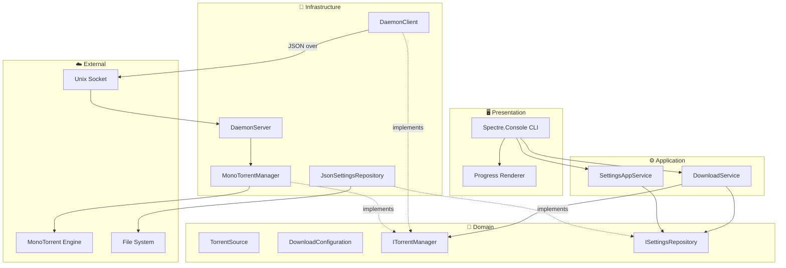

<p align="center">
  <h1 align="center">🌊 TUITorrent (Text UI Torrent)</h1>
  <p align="center">
    A terminal-based BitTorrent client built with .NET 10<br/>
    Daemon architecture · Pause / Resume · Download priority · State persistence · Real-time TUI
  </p>
</p>

<p align="center">
  
  
  
  
  
</p>

---

## 📑 Table of Contents

- [Features](#-features)
- [Quick Start](#-quick-start)
- [Commands](#-commands)
  - [download](#-download-alias-dl)
  - [list](#-list-alias-ls)
  - [status](#-status)
  - [priority](#-priority-alias-prio)
  - [stop / pause](#%EF%B8%8F-stop-alias-pause)
  - [resume](#%EF%B8%8F-resume)
  - [remove](#%EF%B8%8F-remove-alias-rm)
  - [settings](#%EF%B8%8F-settings-alias-config)
  - [daemon](#-daemon)
- [Workflows](#-workflows)
  - [Single download](#single-download-fire--forget)
  - [Multi-download with priority & pause/resume](#multiple-concurrent-downloads-with-priority--pauseresume)
  - [Torrent lifecycle](#torrent-lifecycle)
  - [Daemon lifecycle](#daemon-lifecycle)
- [Architecture](#%EF%B8%8F-architecture)
- [Configuration](#-configuration)
- [Tech Stack](#%EF%B8%8F-tech-stack)
- [License](#-license)

---

## ✨ Features

| | Feature | Description |
|---|---|---|
| 🧲 | **Magnet, URL & .torrent** | Accepts magnet URIs, HTTP/HTTPS URLs to `.torrent` files, and local `.torrent` files |
| 🔄 | **Concurrent downloads** | Multiple simultaneous downloads via background daemon |
| ⏯️ | **Pause / Resume** | Pause any download and resume later — survives daemon restarts |
| 🎯 | **Download priority** | Set Low / Normal / High priority per torrent, sorted in list view |
| 💾 | **State persistence** | Incomplete downloads auto-restore when the daemon restarts |
| 📊 | **Live progress** | Real-time tables with speed, peers, progress |
| ⚙️ | **Persistent settings** | JSON config with per-download CLI overrides |
| 🚀 | **Auto-start daemon** | Daemon launches automatically on first download |
| 🛑 | **Auto-shutdown** | `--exit-when-done` stops daemon when all downloads finish (can be enabled at any time) |
| 🔒 | **Encryption** | Configurable connection encryption (None / Prefer / Require) |
| 🎚️ | **Speed limits** | Per-download or global upload/download throttling |

---

## 🚀 Quick Start

```bash
# 1. Clone & build
git clone <repo-url> && cd TUITorrent
dotnet build

# 2. Check version
dotnet run --project TUITorrent -- --version
# → 1.0.0

# 3. Download a torrent (daemon starts automatically)
dotnet run --project TUITorrent -- dl "magnet:?xt=urn:btih:..." -f

# Or download from a .torrent URL
dotnet run --project TUITorrent -- dl "https://example.com/ubuntu.torrent" -f

# 4. Check all active downloads
dotnet run --project TUITorrent -- ls

# 5. Pause and resume a download
dotnet run --project TUITorrent -- pause a3f2b1c8
dotnet run --project TUITorrent -- resume a3f2b1c8
```

Or publish as a standalone binary:

```bash
dotnet publish TUITorrent -c Release -o dist
./dist/tuitorrent dl "magnet:?xt=urn:btih:..." -f
```

---

## 📖 Commands

### 📥 `download` (alias: `dl`)

Add a torrent to the download queue. Supports magnet links, HTTP/HTTPS URLs to `.torrent` files, and local `.torrent` files. Auto-starts the daemon if not running.

```
tuitorrent download <source> [OPTIONS]
```

| Option | Short | Description |
|---|---|---|
| `<source>` | | Magnet URI, URL to a `.torrent` file, or local `.torrent` file path *(required)* |
| `--output <dir>` | `-o` | Destination directory |
| `--port <port>` | `-p` | Listening port |
| `--dl-limit <KB/s>` | | Max download speed (0 = unlimited) |
| `--ul-limit <KB/s>` | | Max upload speed (0 = unlimited) |
| `--max-connections <n>` | | Max peer connections |
| `--no-seed` | | Don't seed after completion |
| `--follow` | `-f` | Follow progress in real-time |
| `--exit-when-done` | | Shutdown daemon when all downloads complete |

<details>
<summary><b>📋 Examples</b></summary>

```bash
# Basic magnet download
tuitorrent download "magnet:?xt=urn:btih:..."

# Follow progress live
tuitorrent dl "magnet:?xt=urn:btih:..." -f

# Download from a .torrent URL
tuitorrent dl "https://example.com/ubuntu-24.04.torrent" -f

# .torrent file to a specific directory
tuitorrent download ubuntu.torrent -o ~/Downloads/ISOs

# With speed limits, no seeding
tuitorrent dl "magnet:?xt=urn:btih:..." --dl-limit 2048 --ul-limit 512 --no-seed

# Auto-shutdown when done
tuitorrent dl "magnet:?xt=urn:btih:..." --exit-when-done -f

# Queue multiple downloads (magnet, URL, and local file)
tuitorrent dl "magnet:?xt=urn:btih:abc..." --exit-when-done
tuitorrent dl "https://example.com/movie.torrent"
tuitorrent dl fedora.torrent -o /data/isos
# ↑ Daemon auto-exits when all three finish
```

</details>

---

### 📋 `list` (alias: `ls`)

List all active torrents in the daemon.

```
tuitorrent list [OPTIONS]
```

| Option | Short | Description |
|---|---|---|
| `--watch` | `-w` | Continuously refresh (live dashboard) |

<details>
<summary><b>📋 Examples</b></summary>

```bash
# Snapshot view
tuitorrent list

# Live-updating dashboard (Ctrl+C to exit)
tuitorrent ls -w
```

</details>

**Sample output:**

```
╔═ TUITorrent - Active Downloads ══════════════════════════════════════════════════════════════════╗
║ ┌──────────┬────────────────────┬──────────┬─────────────┬──────────┬──────────┬────────┬───────┐ ║
║ │ ID       │ Name               │ Priority │ State       │ Progress │ DL Speed │ UL     │ Peers │ ║
║ ├──────────┼────────────────────┼──────────┼─────────────┼──────────┼──────────┼────────┼───────┤ ║
║ │ a3f2b1c8 │ Ubuntu 24.04 ISO   │ High     │ Downloading │ 45.2%    │ 2.3 MB/s │ 120 KB │ 12    │ ║
║ │ e7d4c9a1 │ Fedora 40 Works... │ Normal   │ Seeding     │ 100.0%   │ 0.0 KB/s │ 540 KB │  8    │ ║
║ │ 1b9e0f42 │ Fetching metadata  │ Low      │ Starting    │ 0.0%     │ 0.0 KB/s │ 0.0 KB │  0    │ ║
║ └──────────┴────────────────────┴──────────┴─────────────┴──────────┴──────────┴────────┴───────┘ ║
╚══════════════════════════════════════════════════════════════════════════════════════════════════╝
```

---

### 🔍 `status`

Show detailed information for a specific torrent.

```
tuitorrent status <id> [OPTIONS]
```

| Option | Short | Description |
|---|---|---|
| `<id>` | | 8-char hex torrent ID *(required)* |
| `--follow` | `-f` | Follow progress in real-time |

<details>
<summary><b>📋 Examples</b></summary>

```bash
# One-time snapshot
tuitorrent status a3f2b1c8

# Live follow until complete
tuitorrent status a3f2b1c8 -f
```

</details>

---

### 🎯 `priority` (alias: `prio`)

Set the download priority of a torrent. Higher priority torrents appear first in the list view.

```
tuitorrent priority <id> <priority>
```

| Argument | Description |
|---|---|
| `<id>` | 8-char hex torrent ID *(required)* |
| `<priority>` | Priority level: `low`, `normal`, or `high` *(required)* |

<details>
<summary><b>📋 Examples</b></summary>

```bash
# Set a torrent to high priority
tuitorrent priority a3f2b1c8 high

# Lower priority of a torrent
tuitorrent prio e7d4c9a1 low

# Reset to default priority
tuitorrent priority a3f2b1c8 normal
```

</details>

---

### ⏸️ `stop` (alias: `pause`)

Pause a torrent download. The torrent remains in the list and can be resumed later.

```
tuitorrent stop <id>
```

```bash
tuitorrent stop a3f2b1c8
tuitorrent pause a3f2b1c8
```

---

### ▶️ `resume`

Resume a paused torrent download.

```
tuitorrent resume <id>
```

```bash
tuitorrent resume a3f2b1c8
```

---

### 🗑️ `remove` (alias: `rm`)

Remove a torrent from the daemon. Stops the download if active.

```
tuitorrent remove <id> [OPTIONS]
```

| Option | Short | Description |
|---|---|---|
| `<id>` | | 8-char hex torrent ID *(required)* |
| `--delete-data` | `-d` | Delete all downloaded files and directories |

<details>
<summary><b>📋 Examples</b></summary>

```bash
# Remove torrent from daemon (keep downloaded files)
tuitorrent remove a3f2b1c8
tuitorrent rm e7d4c9a1

# Remove torrent AND delete all downloaded files/directories
tuitorrent rm a3f2b1c8 -d
tuitorrent remove e7d4c9a1 --delete-data
```

</details>

---

### ⚙️ `settings` (alias: `config`)

View or modify persistent settings. Run without options to display current values.

```
tuitorrent settings [OPTIONS]
```

| Option | Description |
|---|---|
| `--show` | Display current settings |
| `--output <dir>` | Default output directory |
| `--port <port>` | Default listening port |
| `--dl-limit <KB/s>` | Default max download speed (0 = unlimited) |
| `--ul-limit <KB/s>` | Default max upload speed (0 = unlimited) |
| `--max-connections <n>` | Default max connections |
| `--encryption <mode>` | `None`, `Prefer`, or `Require` |
| `--seed <bool>` | Seed after download: `true` / `false` |

<details>
<summary><b>📋 Examples</b></summary>

```bash
# View current settings
tuitorrent settings

# Change output directory
tuitorrent settings --output ~/Downloads/torrents

# Speed limits + disable seeding
tuitorrent config --dl-limit 5120 --ul-limit 1024 --seed false

# Require encryption on a specific port
tuitorrent config --port 6881 --encryption Require

# Set multiple options at once
tuitorrent settings --output /data/downloads --max-connections 100 --port 55555
```

</details>

**Defaults:**

| Setting | Default |
|---|---|
| Output Directory | `~/Downloads` |
| Listen Port | `55123` |
| Max DL / UL Speed | Unlimited |
| Max Connections | `200` |
| Encryption | `Prefer` |
| Seed After Download | `true` |

Settings file: `~/.config/tuitorrent/settings.json`

---

### 🔧 `daemon`

Manage the background daemon. Usually not needed — the daemon auto-starts on first command.

On startup, the daemon automatically restores incomplete downloads from the previous session. Torrents that were actively downloading resume automatically; paused torrents remain paused.

#### `daemon start`

```bash
# Foreground (Ctrl+C to stop)
tuitorrent daemon start

# Auto-exit when all downloads complete
tuitorrent daemon start --exit-when-done
```

#### `daemon stop`

```bash
tuitorrent daemon stop
# State is saved — incomplete downloads will restore on next start
```

#### `daemon status`

```bash
tuitorrent daemon status
# → Daemon is running. PID: 12345
```

#### `--version`

```bash
tuitorrent --version
# → 1.0.0

tuitorrent -v
# → 1.0.0
```

---

## 🔀 Workflows

### Single download (fire & forget)



### Multiple concurrent downloads with priority & pause/resume



### Torrent lifecycle



### Daemon lifecycle



### State persistence



---

## 🏗️ Architecture

TUITorrent follows **Domain-Driven Design (DDD)** with full **Dependency Injection** and **async/await** throughout.



### 📂 Project structure

```
TUITorrent/
├── Domain/                           # 🧠 Core — zero external dependencies
│   ├── Enums/
│   │   ├── EncryptionMode.cs
│   │   └── TorrentPriority.cs
│   ├── ValueObjects/
│   │   ├── TorrentSource.cs          # Validates magnet / URL / .torrent
│   │   └── DownloadConfiguration.cs  # Immutable download config
│   └── Interfaces/
│       ├── ISettingsRepository.cs
│       └── ITorrentManager.cs        # Add / List / Get / Stop / Resume / Remove / Purge / SetPriority
│
├── Application/                      # ⚙️ Use cases & orchestration
│   ├── Models/
│   │   ├── AppSettings.cs
│   │   ├── TorrentInfo.cs            # Rich download snapshot
│   │   └── TorrentProgress.cs        # Status enum
│   └── Services/
│       ├── DownloadService.cs
│       └── SettingsAppService.cs
│
├── Infrastructure/                   # 🔌 External implementations
│   ├── Persistence/
│   │   ├── JsonSettingsRepository.cs # Async JSON file I/O
│   │   └── TorrentStateStore.cs     # Persists active downloads for restore
│   ├── Torrent/
│   │   └── MonoTorrentManager.cs     # Shared ClientEngine + ConcurrentDictionary
│   └── Daemon/
│       ├── DaemonProtocol.cs         # Request/Response types + serialization
│       ├── DaemonServer.cs           # Unix socket listener
│       └── DaemonClient.cs           # Socket client + auto-start logic
│
├── Presentation/                     # 🖥️ CLI layer
│   ├── Commands/
│   │   ├── DownloadCommand.cs
│   │   ├── ListCommand.cs
│   │   ├── StatusCommand.cs
│   │   ├── PriorityCommand.cs
│   │   ├── StopTorrentCommand.cs
│   │   ├── ResumeTorrentCommand.cs
│   │   ├── RemoveTorrentCommand.cs
│   │   ├── SettingsCommand.cs
│   │   └── DaemonCommand.cs
│   ├── Rendering/
│   │   └── TorrentProgressRenderer.cs
│   └── Infrastructure/
│       ├── TypeRegistrar.cs          # DI ↔ Spectre.Console bridge
│       └── TypeResolver.cs
│
└── Program.cs                        # Entry point + DI registration
```

---

## 📁 Configuration

### Files & paths

| Path | Description |
|---|---|
| `~/.config/tuitorrent/settings.json` | 📝 Persistent settings |
| `~/.config/tuitorrent/torrents.json` | 📋 Active downloads state (auto-restored on daemon restart) |
| `~/.config/tuitorrent/torrents/` | 📦 Cached `.torrent` files for restoration |
| `~/.config/tuitorrent/daemon.sock` | 🔌 Unix domain socket (IPC) |
| `~/.config/tuitorrent/daemon.pid` | 🆔 Daemon process ID |
| `~/.config/tuitorrent/daemon.log` | 📄 Daemon log (daily rolling, 7 days retained) |
| `~/.config/tuitorrent/cache/` | 💾 MonoTorrent engine cache (fast resume & metadata) |

### Settings JSON example

```json
{
  "outputDirectory": "/Users/you/Downloads",
  "listenPort": 55123,
  "maxDownloadSpeedKbps": 0,
  "maxUploadSpeedKbps": 0,
  "maxConnections": 200,
  "encryption": "Prefer",
  "seedAfterDownload": true
}
```

---

## 🛠️ Tech Stack

| Library | Version | Purpose |
|---|---|---|
| [MonoTorrent](https://github.com/alanmcgovern/monotorrent) | 3.0.2 | BitTorrent protocol engine |
| [Spectre.Console](https://spectreconsole.net/) | 0.54.0 | Terminal UI rendering |
| [Spectre.Console.Cli](https://spectreconsole.net/cli/) | 0.53.1 | CLI argument parsing & DI |
| [Serilog](https://serilog.net/) | 4.2.0 | Structured logging |
| [Microsoft.Extensions.DI](https://learn.microsoft.com/en-us/dotnet/core/extensions/dependency-injection) | 10.0.3 | Dependency injection |

---

## 📄 License

This project is licensed under the [MIT License](LICENSE).
